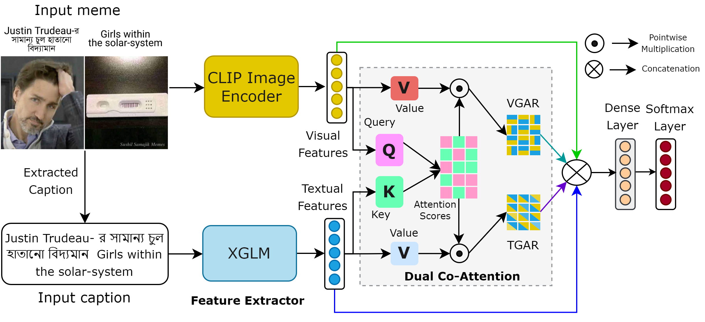

# 👺 Multimodal Hate Speech Detection in Bengali

📢 **Paper Release**

**Align before Attend: Aligning Visual and Textual Features for Multimodal Hateful Content Detection** (EACL-SRW, 2024) [[Paper](https://aclanthology.org/2024.eacl-srw.12/)] [[Code](https://github.com/eftekhar-hossain/Bengali-Hateful-Memes/tree/main/Align-Before-Attend%40EACL)]  <br>
[Eftekhar Hossain*](https://eftekhar-hossain.github.io/), [Omar Sharif*](https://omar-sharif03.github.io/), [Mohammed Moshiul Hoque](https://scholar.google.com/citations?user=srYxYhcAAAAJ&hl=en), [Sarah M Preum](https://persist-lab.github.io/portfolio/) (*Equal Contribution)

**Deciphering Hate: Identifying Hateful Memes and Their Targets** (ACL, 2024) [[Paper](https://arxiv.org/abs/2403.10829)] [[Code]()]  <br>
[Eftekhar Hossain](https://eftekhar-hossain.github.io/), [Omar Sharif](https://omar-sharif03.github.io/), [Mohammed Moshiul Hoque](https://scholar.google.com/citations?user=srYxYhcAAAAJ&hl=en), [Sarah M Preum](https://persist-lab.github.io/portfolio/)


## 🌴Align before Attend (EACL'24)

Multimodal hateful content detection is a challenging task that requires complex reasoning across visual and textual modalities. Therefore, creating a meaningful multimodal representation that effectively captures the interplay between visual and textual features through intermediate fusion is critical. Conventional fusion techniques are unable to attend to the modality-specific features effectively. Moreover, most studies exclusively concentrated on English and overlooked other low-resource languages. We propose a **context-aware attention** framework for multimodal hateful content detection and assess it for both English and non-English languages. The proposed approach incorporates an **attention layer** to meaningfully align the visual and textual features. This alignment enables selective focus on modality-specific features before fusing them. The proposed performs superiorly on two benchmark hateful meme datasets, viz. **MUTE (Bengali code-mixed)** and **MultiOFF (English)**. 

<p align="center">
    <a href="https://llava.hliu.cc/"></a> <br>
    The method proposed in Align before Attend Paper.
</p>

### Datasets
[MUTE](https://github.com/eftekhar-hossain/MUTE-AACL22) (Bengali Hateful Memes Dataset) <br> 
[MultiOFF](https://github.com/bharathichezhiyan/Multimodal-Meme-Classification-Identifying-Offensive-Content-in-Image-and-Text) (English Offensive Memes Dataset)

#### How to Run 🤝
Please check out our [instructions](https://github.com/eftekhar-hossain/Bengali-Hateful-Memes/tree/main/Align-Before-Attend%40EACL) to run the model and its variants on a multimodal dataset.  


## ♨️Deciphering Hate (ACL'24)

Internet memes have become a powerful means for individuals to express emotions, thoughts, and perspectives on social media. While often considered a source of humor and entertainment, memes can also disseminate hateful content targeting individuals or communities. Most existing research focuses on the negative aspects of memes in high-resource languages, overlooking the distinctive challenges associated with low-resource languages like Bengali (also known as Bangla). Furthermore, while previous work on Bengali memes has focused on detecting hateful memes, there has been no work on detecting their targeted entities. To bridge this gap and facilitate research in this arena, we introduce a novel multimodal dataset for Bengali, **BHM (Bengali Hateful Memes)**. The dataset consists of 7,148 memes with Bengali as well as code-mixed captions, tailored for two tasks: (i) detecting hateful memes and (ii) detecting the social entities they target (i.e., Individual, Organization, Community, and Society). To solve these tasks, we propose **DORA (Dual cO -attention fRAmework)**, a multimodal deep neural network that systematically extracts the significant modality features from the memes and jointly evaluates them with the modality-specific features to understand the context better. Our experiments show that DORA is generalizable on other low-resource hateful meme datasets and outperforms several state-of-the-art rivaling baselines. 

<p align="center">
    <a href="https://llava.hliu.cc/"></a> <br>
    The method proposed in Deciphering Hate Paper.
</p>

### Dataset 👉 [[Link](https://drive.google.com/file/d/1ozTFUM7q27g7uckhPWUiQFwhROCiEUAc/view?usp=sharing)]

#### How to Load using Python
   
```python
import gdown
# Replace 'YOUR_FILE_ID' with the actual file ID from the Google Drive link.
gdown.download("https://drive.google.com/uc?export=download&id=1ozTFUM7q27g7uckhPWUiQFwhROCiEUAc", "file.zip", quiet=False)
```
After running the cell, the dataset will be downloaded as **file.zip**

#### Unzip the file.zip

```python
import zipfile
zip_ref = zipfile.ZipFile("file.zip", 'r')
zip_ref.extractall()
zip_ref.close()
```

----


## 🐧Related Papers
- **A Multimodal Framework to Detect Target Aware Aggression in Memes** (*EACL'24*) [[Paper](https://aclanthology.org/2024.eacl-long.153/)] [[Dataset](https://github.com/shawlyahsan/Bengali-Aggression-Memes)]
- **MUTE: A Multimodal Dataset for Detecting Hateful Memes** (*AACL'22*) [[Paper](https://aclanthology.org/2022.aacl-srw.5/)] [[Code](https://github.com/eftekhar-hossain/MUTE-AACL22)]
- **MemoSen: A Multimodal Dataset for Sentiment Analysis of Memes** (*LREC'22*) [[Paper](https://aclanthology.org/2022.lrec-1.165/)] [[Code](https://github.com/eftekhar-hossain/MemoSen-LREC2022)]


## Citation

If you find our works useful for your research and applications, please cite using this BibTeX:
```bibtex

@article{hossain2024deciphering,
  title={Deciphering Hate: Identifying Hateful Memes and Their Targets},
  author={Hossain, Eftekhar and Sharif, Omar and Hoque, Mohammed Moshiul and Preum, Sarah M},
  journal={arXiv preprint arXiv:2403.10829},
  year={2024}
}

@article{hossain2024align,
  title={Align before Attend: Aligning Visual and Textual Features for Multimodal Hateful Content Detection},
  author={Hossain, Eftekhar and Sharif, Omar and Hoque, Mohammed Moshiul and Preum, Sarah M},
  journal={arXiv preprint arXiv:2402.09738},
  year={2024}
}

@inproceedings{ahsan2024multimodal,
  title={A Multimodal Framework to Detect Target Aware Aggression in Memes},
  author={Ahsan, Shawly and Hossain, Eftekhar and Sharif, Omar and Das, Avishek and Hoque, Mohammed Moshiul and Dewan, M},
  booktitle={Proceedings of the 18th Conference of the European Chapter of the Association for Computational Linguistics (Volume 1: Long Papers)},
  pages={2487--2500},
  year={2024}
}

@inproceedings{hossain2022mute,
  title={Mute: A multimodal dataset for detecting hateful memes},
  author={Hossain, Eftekhar and Sharif, Omar and Hoque, Mohammed Moshiul},
  booktitle={Proceedings of the 2nd conference of the asia-pacific chapter of the association for computational linguistics and the 12th international joint conference on natural language processing: student research workshop},
  pages={32--39},
  year={2022}
}

@inproceedings{hossain2022memosen,
  title={Memosen: A multimodal dataset for sentiment analysis of memes},
  author={Hossain, Eftekhar and Sharif, Omar and Hoque, Mohammed Moshiul},
  booktitle={Proceedings of the Thirteenth Language Resources and Evaluation Conference},
  pages={1542--1554},
  year={2022}
}

```
